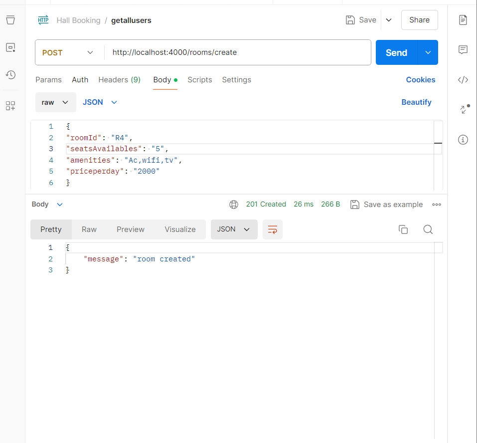
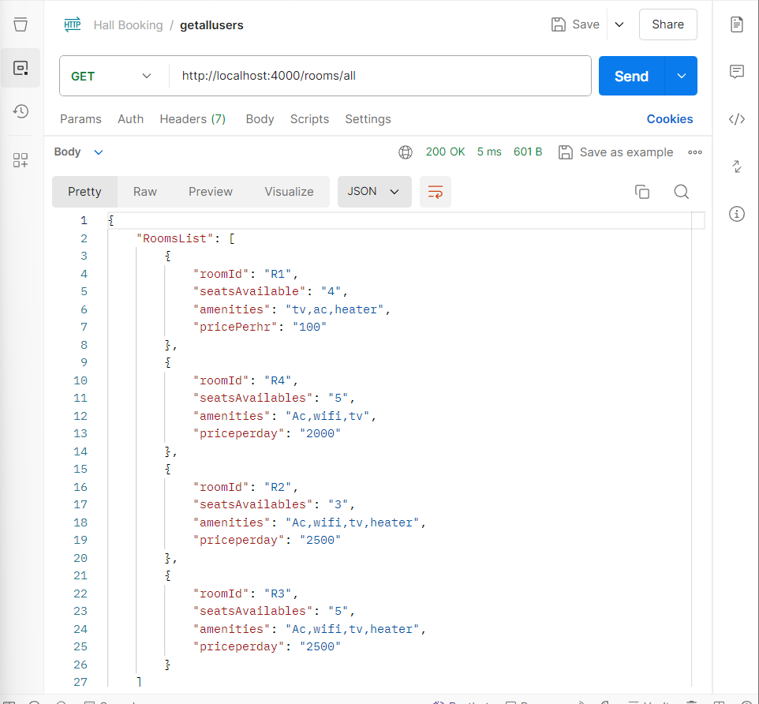
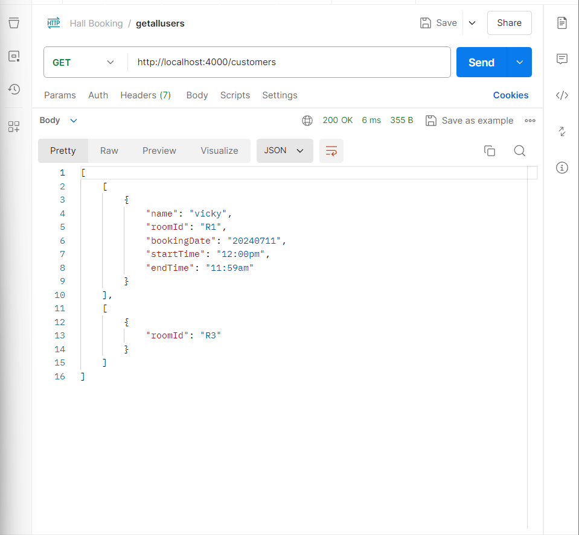
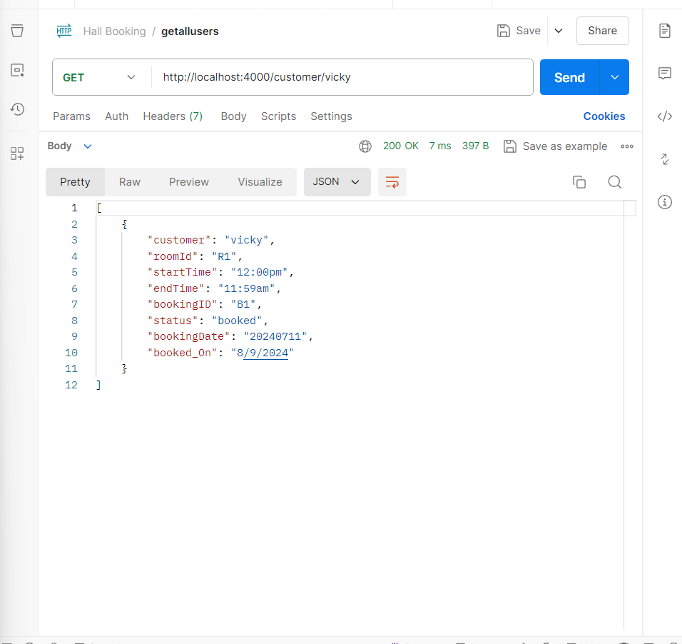
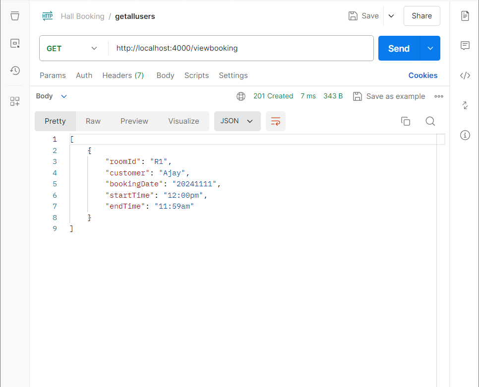
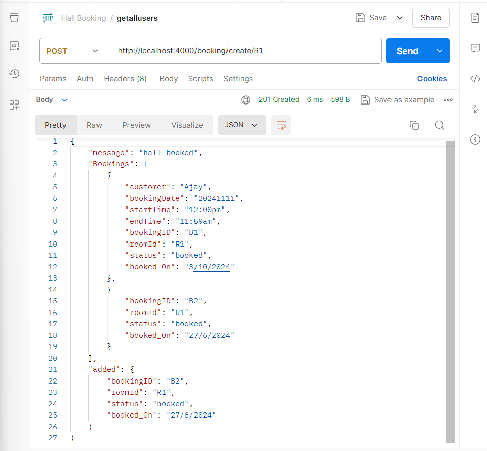

**Hall Booking API**

This documentation is about the Hall Booking application done using NodeJS and Express. This API allows you to manage room bookings, create rooms, and retrieve booking details.

Task: Write API for hall booking application

The task is to write API for hall booking app for

1. Creating a Room with

  - Number of seats available
  - amenities in room
  - price per hour

2. Booking a room with

  - Customer Name
  - Date
  - Start Time
  - End Time
  - Room name

3. List all Rooms with Booked data with

  - Room Name
  - Booked Status
  - Customer Name
  - Date
  - Start Time
  - End Time

4. List all customers with booked data with

  - Customer Name
  - Room Name
  - Date
  - Start Time
  - End Time

5. List how many times a customer has booked the room with below details

  - Customer Name
  - Room Name
  - Date
  - Start Time
  - End Time
  - Booking ID
  - Booking Date
  - Booking Status

**Models:**

1. rooms

  - room_name
  - number_of_seats
  - amenities
  - price_per_hour
  - bookings

2. room_name
  - customer_name
  - date
  - start_time
  - end_time
  - booking_id
  - booking_date
  - booking_status

**APIs:**

1. Create Room

  - POST /rooms
  - Request Body: {room_name, number_of_seats, amenities, price_per_hour}
  - Response: {room_name, number_of_seats, amenities, price_per_hour}

2. Book Room

  - POST /bookings
  - Request Body: {room_name, customer_name, date, start_time, end_time}
  - Response: {room_name, customer_name, date, start_time, end_time, booking_id, booking_date, booking_status}

3. List all Rooms with Booked data

  - GET /rooms
  - Response: [{room_name, booked_status, customer_name, date, start_time, end_time}]

4. List all customers with booked data

  - GET /customers
  - Response: [{customer_name, room_name, date, start_time, end_time}]

5. List how many times a customer has booked the room

  - GET /customers/:customer_name
  - Response: [{customer_name, room_name, date, start_time, end_time, booking_id, booking_date, booking_status}]

